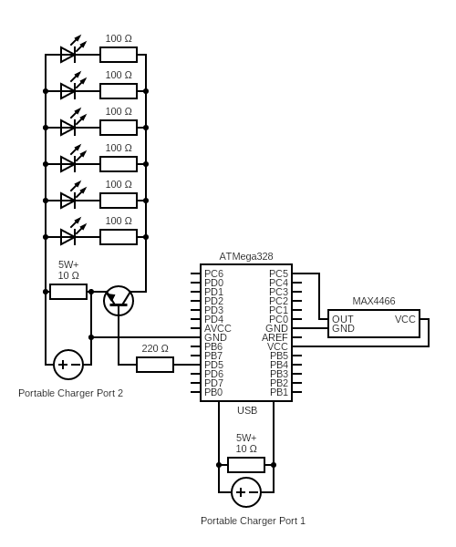

# LED Audio Visualizer

  

  <h2>Overview</h2>
  
  

    This project uses an Arduino Nano and an MAX4466 (electret microphone amplifier) breakout board to dynamically scale LED brightness in response to sound.
    The visual output resembles pre-programmed lighting, with brightness peaks smoothly matching to the beat of music.
      
    To achieve this, the Arduino polls the MAX4466's analog output at 100Hz (adjustable), places the amplitude samples in a circular buffer, and uses the stored values to calculate a continuous average.
    For each sample, the amplitude is compared to the continuous average to scale LED brightness scales from 0 to 255.
    Custom 3D printed parts are used to house the electronics and battery.
  

   
  

  <a href="https://www.youtube.com/watch?v=eAFF40k64hU" target="_blank">See it in action!</a>

 

## Requirements
* Arduino or most other microcontrollers
  * Low minimum specs: **4kb flash memory** and **500b RAM**
  * Must support: PWM, 2 GPIO Pins
* Arduino programming
  * ArduinoIDE
  * USB-A to USB-Mini cable
* 3D printer and slicer software
* Soldering iron
* Wire strippers / cutters
* Wire snipper (needs to be small)
* Electronic and housing components [(see below)](#component-list)
* Music

## Usage
MAX4466 Amplitude is adjustable. On the breakout board featured in the [components](#electronic-components), the amp knob is a small, rotatable plate on the underside of the board.
This project is designed for high amplitude environemnts; subsequently, the amplification is set to minimum for this project.

### Config
* Set `LED_PIN` and `MIC_PIN` to appropriate digital PWM pin and analog pin on the Arduino
* **Timing adjustments:**
  * `SAMPLE_TIME`: The period in milliseconds over which amplitude is calculated. If `SAMPLE_TIME` = 10, sample rate = 100Hz.
  * `WINDOW_SIZE`: The size of the circular buffer. Larger buffers take longer to adjust to new average sound levels.
  * `RUNNING_ITERS`: The number of samples taken before an inner average is added to the window. Large values allow accurate and long continuous averages in memory constrained environments.
  
    Average period (seconds) = `SAMPLE_TIME * WINDOW_SIZE * RUNNING_ITERS / 1000`
  
* **Sensitivity adjustments:**
  * `PEAK`: The coefficient of the continuous average for the brightness ceiling.
    
    brightness = max IF sample ≥ continuous_average * PEAK
    
  * `VALLEY`: The coefficient of the continous average for the brightness floor.
    
    brightness = min IF sample ≤ continuous_average * VALLEY
    

 

## Component List

### Electronic Components
1. 1x [Arduino Nano (ATMega328)](https://www.amazon.com/dp/B0CM3C3FCZ) (or any comprable MCU)
2. 1x [MAX4466 (electret microphone and amp)](https://www.amazon.com/dp/B08N4FNFTR)
3. 1x [INIU portable charger](https://www.amazon.com/dp/B09176JCKZ)
4. 2x [10Ω 5W resistor](https://www.amazon.com/dp/B0DV3LVCJG)
5. 6x 3.0~3.2V/20mA LEDs
6. 6x 100Ω 1/4W 1% resistors
7. 1x Cable A: 12+ inch USB-A cable (other end does not matter)
8. 1x Cable B: 10+ inch USB-Mini to USB-A cable (separate from Arduino programming cable)
9. 1x 5cm x 7cm (solderable) through hole PCB
10. 1x 2N2222: NPN bipolar junction transistor
11. 3x solderable breadboard wires (≥6")

### Housing Components
1. [Transparent 1.75mm PLA](https://www.amazon.com/dp/B07ZNG4L9P) (usage of other PLA is optional)
2. [7x M3 70mm machine screws with nuts](https://www.amazon.com/dp/B07D4KLF5H)
3. [6-12 foot painter pole](https://www.homedepot.com/p/Wooster-6-ft-12-ft-Sherlock-Extension-Pole-00R0560000/100132422)
4. Super glue

### 3D Printed Components
1. With *any* PLA:
   * totemBaseBottom.stl
   * totemBaseMiddle.stl
   * totemBaseTop.stl
2. With **transparent** PLA:
   * totemOrbFull.stl **- OR -** *both* totemOrbHalfBottom.stl *and* totemOrbHalfTop.stl (with transparent PLA)

 

## How to Build

### I - Initial Assembly
1. Using the USB-A to Mini cable mentioned in the [Requirements](#requirements), connect the Arduino to your personal computer. Using ArduinoIDE, flash the Arduino with totem.ino. 
2. 3D print all the necessary components. The totemBaseBottom, totemBaseMiddle, and totemBaseTop pieces do not need supports.
   * For printing the orb in one piece: Use supports on the inside of totemOrbFull, supporting the center.
   * For printing the orb in two pieces: Use supports on totemOrbHalfTop. Superglue the orb halves together once printed.

### II - Cable Setup
***For these steps, refer to the [Cable Rerefence](#cable-reference-table) below.***
1. Cut Cable A such that there is 5 inches of length off of the USB-A end. On the other end, cut the connector off and leave at least 7 inches of length.
2. Similarly, cut Cable B such that there is 5 inches of length off the USB-A end, and 5 inches of length off the USB-Mini end.
3. On all 3 cable remenants with ports, strip the wire on the non-port end to expose 1.5 inches of the internal red and black wires. Do this to both sides of the Cable A half that does not have a port attached.
4. Strip 0.5 inches off of each of the red and black wire end to expose the copper. This should be 10 copper wires in total.
5. Wrap both halves of Cable B's exposed wire on each side of a 10Ω 5W resistor such that both red wires in Cable B are on the same side of the resistor, and both black on the other.
6. Similarly, do this with the ends of both halves of Cable A on the other 10Ω 5W resistor.

### III - Wiring & Soldering
***For these steps, refer to the [Schematics](#circuit-diagrams) below.***
1. Solder the 10Ω 5W resistor to the copper wire in the usb lines. You now have reconstructed Cable A and Cable B, but with a 10Ω 5W resistor in the line.
2. Solder the Arduino, LEDs, 2N2222, and resistors to the PCB Board.
3. Solder the red exposed wire of Cable A to the LEDs, and the black exposed wire to the 2N2222's emitter.
4. For the connections between the Arduino and MAX4466, solder the breadboard wires to their respective pins and the MAX4466 breakout board.
5. Snip the ends of the solid leads on the breadboard wires so that the connection is flush with the MAX4466 breakout board's topside, as well as the ends of the other wires  in steps 2, 3, and 4.

> [!WARNING]
> The 10Ω resistors between in the USB cables ***MUST BE ≥ 5 WATTS*** or you risk the resistor **EXPLODING** OR **CATCHING FIRE**. 

### IV - Mount Electronics
1. Feed the MAX4466 through totemBaseTop, between the outer wall and running supports, on the side with 2 screw holes.
2. Super glue the MAX4466 to the inside of totemBaseMiddle, with the Bare Wire]phone part of the component inside the hole in the side.
3. Once the MAX4466 is secure, slot the INIU portable charger inside totemBaseMiddle, with the ports accessible through the side cutout.
4. Slot the PCB onto the pegs on the running supports of totemBaseTop. You may want to use super glue to secure the PCB to totemBaseTop.
5. Plug Cable B into the Arduino's USB-Mini port, and feed the cable through the cutout along the top of totemBaseTop.

### V - Final Assembly
1. Slide totemBaseBottom onto the end of the painter's pole so that the holes line up. Slide one of the M3 70mm machine screws through the holes and secure with the nut.
2. Insert the remaining three machine screws through the housing via the opening on totemBaseBottom, through all three totem base components.
3. Set the totem orb on top of the base components, aligning it's screw holes with the base pieces'.
4. Secure the whole housing together by screwing the nuts onto the ends of the machine screws.

 

### Cable Reference Table

#### Unmodified cables

&nbsp;&nbsp;&nbsp;&nbsp;A:&nbsp;&nbsp;[USB-A]-[12" Jacket]-[Any USB]

&nbsp;&nbsp;&nbsp;&nbsp;B:&nbsp;&nbsp;[USB-A]-[10" Jacket]-[USB-Mini]

#### Cable Setup step 2: Both cables cut into separate ends, non USB-A connector cut off of cable A

&nbsp;&nbsp;&nbsp;&nbsp;A1: [5" Jacket]-[USB-A]  
&nbsp;&nbsp;&nbsp;&nbsp;A2: [7" Jacket]

&nbsp;&nbsp;&nbsp;&nbsp;B1: [5" Jacket]-[USB-A]  
&nbsp;&nbsp;&nbsp;&nbsp;B2: [5" Jacket]-[USB-Mini]

#### Cable Setup step 4: Cable jacket stripped to red and black signal wires, signal wires stripped to bare copper

&nbsp;&nbsp;&nbsp;&nbsp;A1: [0.5" Bare Wire]-[1" Signal Wires]-[3.5" Jacket]-[USB-A]  
&nbsp;&nbsp;&nbsp;&nbsp;A2: [0.5" Bare Wire]-[1" Signal Wires]-[4" Jacket]-[1" Signal Wire]-[0.5" Bare Wire]

&nbsp;&nbsp;&nbsp;&nbsp;B1: [0.5" Bare Wire]-[1" Signal Wires]-[3.5" Jacket]-[USB-A]  
&nbsp;&nbsp;&nbsp;&nbsp;B2: [0.5" Bare Wire]-[1" Signal Wires]-[3.5" Jacket]-[USB-Mini]

#### Cable Setup Step 6: Final cable configuration with 10Ω 5W resistors

&nbsp;&nbsp;&nbsp;&nbsp;A:&nbsp; [USB-A]-[3.5" Jacket]-[1" Signal Wires]-[Resistor]-[1" Signal Wires]-[4" Jacket]-[1" Signal Wires]-[0.5" Bare Wire]

&nbsp;&nbsp;&nbsp;&nbsp;B:&nbsp; [USB-A]-[3.5" Jacket]-[1" Signal Wires]-[Resistor]-[1" Signal Wires]-[3.5" Jacket]-[USB-Mini]

 

### Circuit Diagrams

<table width="100%">
  <tr>
    <td align="center" width="51%">
       
      - Schematic Diagram -
         
    </td>
    <td align="center" width="48.5%">
       
      - Pictoral Diagram -
       (see notes)
    </td>
  </tr>
</table>

> [!NOTE]
> The Pictoral Circuit Diagram is missing key information:  
> - The USB power icon refers to Cable A, and, The Arduino needs to be plugged into the INIU portable via Cable B. See items 7, 3, 8 in [Electronic Components](#electronic-components).  
> - Both the USB cable to the Arduino and transistor need to have a 10Ω 5W resistor to prevent the INIU battery from performing automatic shutoff.  

> [!TIP]
> Depending on the number and specs of the LEDs you use, you will likey have to use different resistors. You can use [this website](https://ledcalculator.net/) to calculate which resistors you need.  
